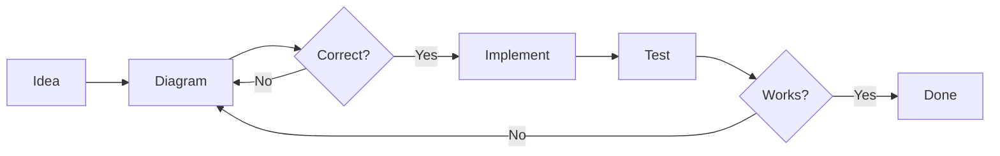

# Co-Creation Rules 🤝

## Working Together

### 1. Diagrams First
- Always create Mermaid diagrams before implementing
- Test that diagrams render correctly
- Ask "Is this correct?" before coding
- Update diagrams when design changes

### 2. Communication Style
- Peer-to-peer collaboration
- No unnecessary apologies
- Direct and clear communication
- Focus on solutions

### 3. Development Flow


### 4. Code Quality
- Test before showing results
- Clean, readable code
- Meaningful variable names
- Comments only when necessary

### 5. Project Structure
```
claude-wrapper/
├── CLAUDE.md           # This file - our rules
├── architecture.md     # System design diagrams
├── claude-wrapper.js   # Main implementation
├── index.js           # Demo/test file
├── chats/             # Saved conversations
└── examples/          # Usage examples
```

### 6. Current Focus
Building a continuous conversation mode wrapper for Claude CLI that:
- Keeps process alive
- Manages chats seamlessly
- Saves conversations automatically
- Allows loading previous chats

### 7. Testing Protocol
- Run code before presenting
- Show actual output
- Fix issues before reporting complete
- Include error handling

### 8. Iteration Speed
- Quick prototypes
- Fail fast, fix fast
- Show working demos
- Iterate based on feedback