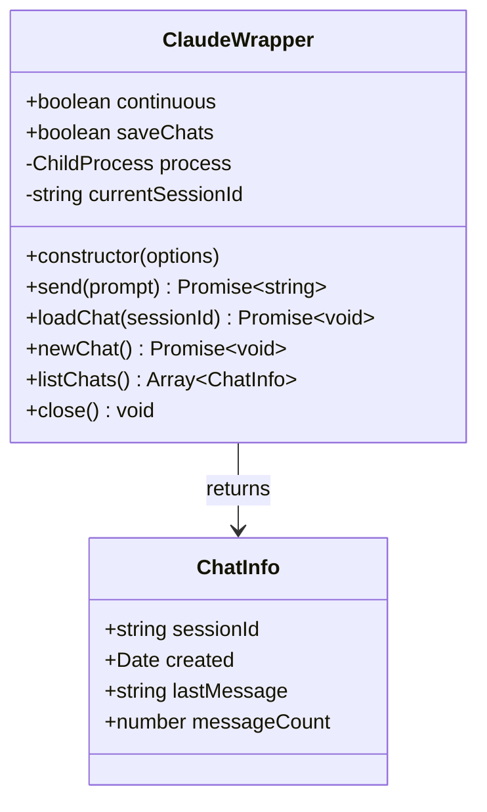

# API Design

```mermaid
classDiagram
    class ClaudeWrapper {
        +boolean continuous
        +boolean saveChats
        -ChildProcess process
        -string currentSessionId
        
        +constructor(options)
        +send(prompt) Promise~string~
        +loadChat(sessionId) Promise~void~
        +newChat() Promise~void~
        +listChats() Array~ChatInfo~
        +close() void
    }
    
    class ChatInfo {
        +string sessionId
        +Date created
        +string lastMessage
        +number messageCount
    }
    
    ClaudeWrapper --> ChatInfo : returns
```