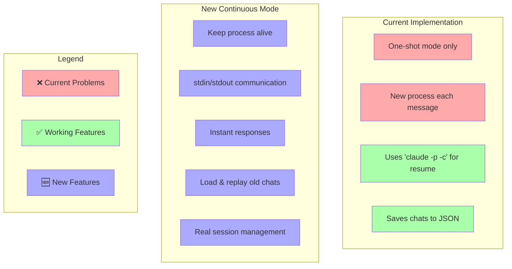
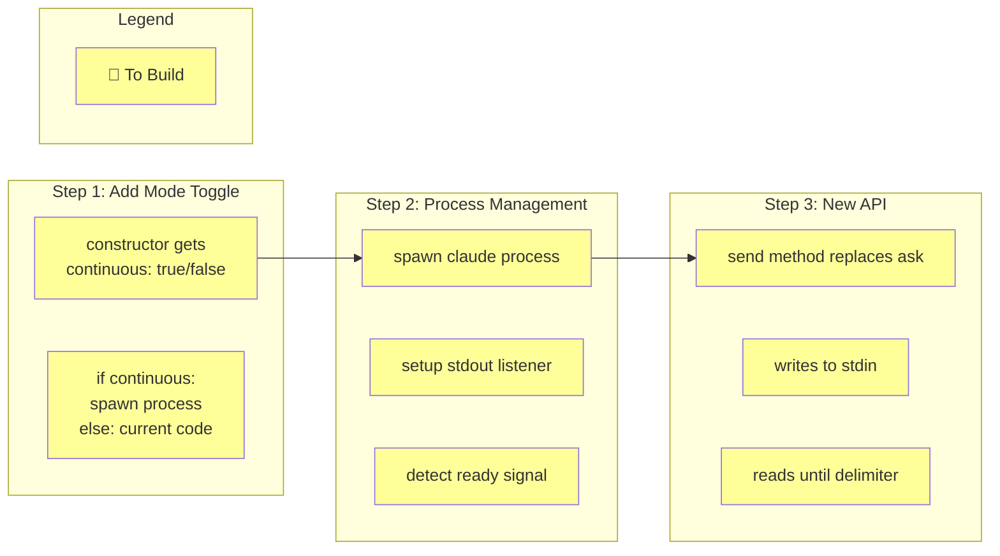
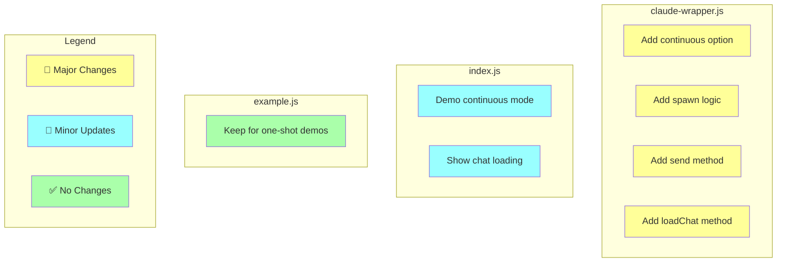

# Changes Overview

## What We're Building vs Current State

```mermaid
flowchart TB
    subgraph "Current Implementation"
        C1[One-shot mode only] 
        C2[New process each message]
        C3[Uses 'claude -p -c' for resume]
        C4[Saves chats to JSON]
        
        style C1 fill:#faa
        style C2 fill:#faa
        style C3 fill:#afa
        style C4 fill:#afa
    end
    
    subgraph "New Continuous Mode"
        N1[Keep process alive]
        N2[stdin/stdout communication]
        N3[Instant responses]
        N4[Load & replay old chats]
        N5[Real session management]
        
        style N1 fill:#aaf
        style N2 fill:#aaf
        style N3 fill:#aaf
        style N4 fill:#aaf
        style N5 fill:#aaf
    end
    
    subgraph "Legend"
        L1[❌ Current Problems]
        L2[✅ Working Features]
        L3[🆕 New Features]
        
        style L1 fill:#faa
        style L2 fill:#afa
        style L3 fill:#aaf
    end
```

## Implementation Changes

```mermaid
flowchart LR
    subgraph "Step 1: Add Mode Toggle"
        A1[constructor gets<br/>continuous: true/false]
        A2[if continuous:<br/>spawn process<br/>else: current code]
        
        style A1 fill:#ff9
        style A2 fill:#ff9
    end
    
    subgraph "Step 2: Process Management"
        B1[spawn claude process]
        B2[setup stdout listener]
        B3[detect ready signal]
        
        style B1 fill:#ff9
        style B2 fill:#ff9
        style B3 fill:#ff9
    end
    
    subgraph "Step 3: New API"
        C1[send method replaces ask]
        C2[writes to stdin]
        C3[reads until delimiter]
        
        style C1 fill:#ff9
        style C2 fill:#ff9
        style C3 fill:#ff9
    end
    
    A1 --> B1 --> C1
    
    subgraph "Legend"
        TODO[🔨 To Build]
        style TODO fill:#ff9
    end
```

## File Changes Summary

```mermaid
graph TD
    subgraph "claude-wrapper.js"
        W1[Add continuous option]
        W2[Add spawn logic]
        W3[Add send method]
        W4[Add loadChat method]
        
        style W1 fill:#ff9
        style W2 fill:#ff9
        style W3 fill:#ff9
        style W4 fill:#ff9
    end
    
    subgraph "index.js"
        I1[Demo continuous mode]
        I2[Show chat loading]
        
        style I1 fill:#9ff
        style I2 fill:#9ff
    end
    
    subgraph "example.js"
        E1[Keep for one-shot demos]
        
        style E1 fill:#afa
    end
    
    subgraph "Legend"
        M1[🔨 Major Changes]
        M2[📝 Minor Updates]
        M3[✅ No Changes]
        
        style M1 fill:#ff9
        style M2 fill:#9ff
        style M3 fill:#afa
    end
```