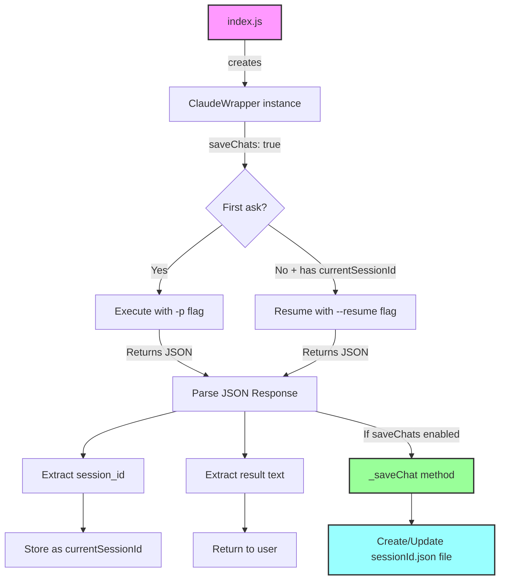

# Current Implementation

```mermaid
flowchart TD
    A[index.js] -->|creates| B[ClaudeWrapper instance]
    B -->|saveChats: true| C{First ask?}
    
    C -->|Yes| D[Execute with -p flag]
    C -->|No + has currentSessionId| E[Resume with --resume flag]
    
    D -->|Returns JSON| F[Parse JSON Response]
    E -->|Returns JSON| F
    
    F --> G[Extract session_id]
    F --> H[Extract result text]
    
    G --> I[Store as currentSessionId]
    H --> J[Return to user]
    
    F -->|If saveChats enabled| K[_saveChat method]
    K --> L[Create/Update sessionId.json file]
    
    style A fill:#f9f,stroke:#333,stroke-width:2px
    style K fill:#9f9,stroke:#333,stroke-width:2px
    style L fill:#9ff,stroke:#333,stroke-width:2px
```