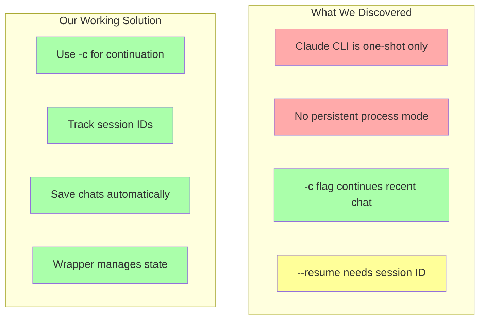
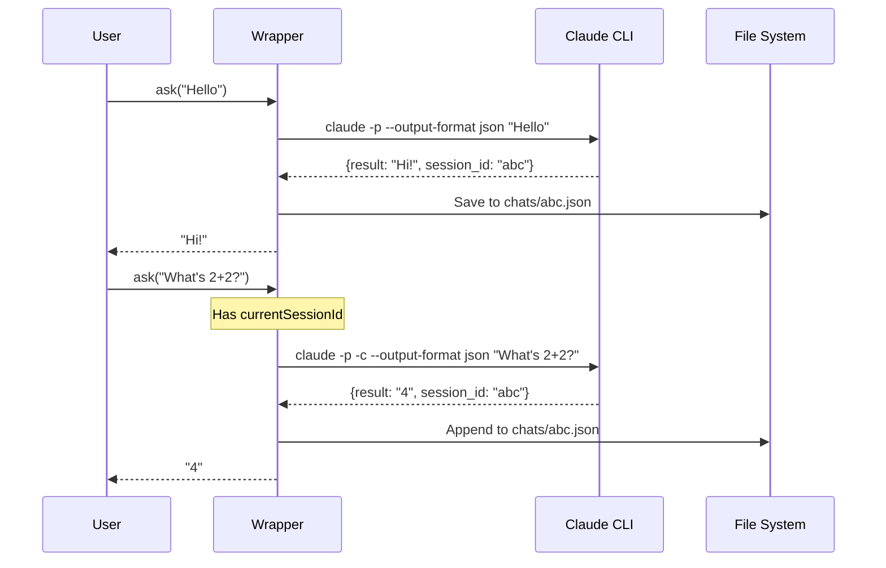
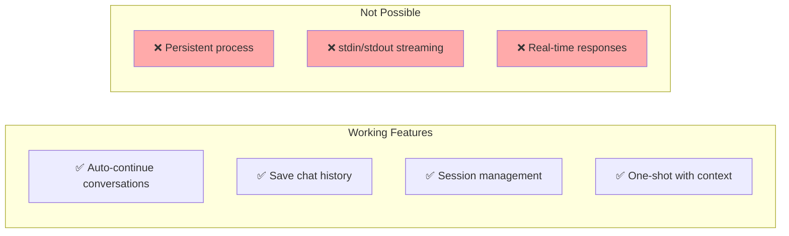

# Final Architecture

## Claude CLI Limitations & Our Solution

```mermaid
flowchart TD
    subgraph "What We Discovered"
        D1[Claude CLI is one-shot only]
        D2[No persistent process mode]
        D3["-c flag continues recent chat"]
        D4["--resume needs session ID"]
        
        style D1 fill:#faa
        style D2 fill:#faa
        style D3 fill:#afa
        style D4 fill:#ff9
    end
    
    subgraph "Our Working Solution"
        S1[Use -c for continuation]
        S2[Track session IDs]
        S3[Save chats automatically]
        S4[Wrapper manages state]
        
        style S1 fill:#afa
        style S2 fill:#afa
        style S3 fill:#afa
        style S4 fill:#afa
    end
```

## Current Working Implementation

```mermaid
sequenceDiagram
    participant User
    participant Wrapper
    participant Claude CLI
    participant File System
    
    User->>Wrapper: ask("Hello")
    Wrapper->>Claude CLI: claude -p --output-format json "Hello"
    Claude CLI-->>Wrapper: {result: "Hi!", session_id: "abc"}
    Wrapper->>File System: Save to chats/abc.json
    Wrapper-->>User: "Hi!"
    
    User->>Wrapper: ask("What's 2+2?")
    Note over Wrapper: Has currentSessionId
    Wrapper->>Claude CLI: claude -p -c --output-format json "What's 2+2?"
    Claude CLI-->>Wrapper: {result: "4", session_id: "abc"}
    Wrapper->>File System: Append to chats/abc.json
    Wrapper-->>User: "4"
```

## Features We Built

```mermaid
graph LR
    subgraph "Working Features"
        F1[✅ Auto-continue conversations]
        F2[✅ Save chat history]
        F3[✅ Session management]
        F4[✅ One-shot with context]
    end
    
    subgraph "Not Possible"
        N1[❌ Persistent process]
        N2[❌ stdin/stdout streaming]
        N3[❌ Real-time responses]
        
        style N1 fill:#faa
        style N2 fill:#faa
        style N3 fill:#faa
    end
```