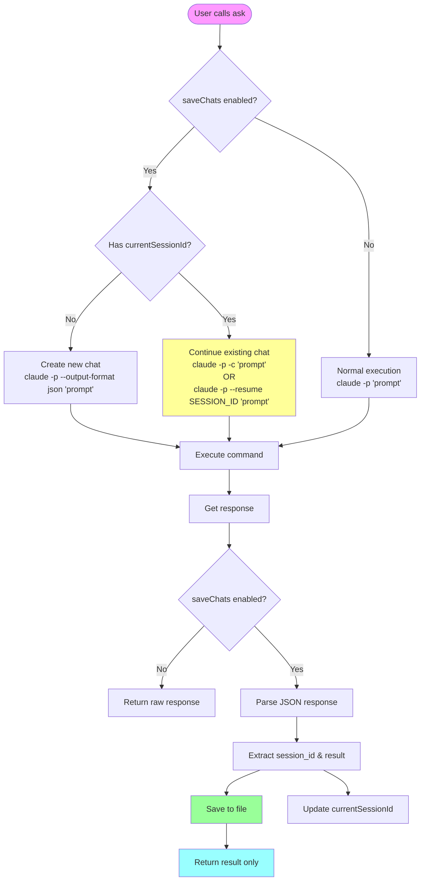

# Fixed Architecture

```mermaid
flowchart TD
    Start([User calls ask]) --> Check{saveChats enabled?}
    
    Check -->|No| Normal["Normal execution<br/>claude -p 'prompt'"]
    Check -->|Yes| SaveMode{Has currentSessionId?}
    
    SaveMode -->|No| NewChat["Create new chat<br/>claude -p --output-format json 'prompt'"]
    SaveMode -->|Yes| Continue["Continue existing chat<br/>claude -p -c 'prompt'<br/>OR<br/>claude -p --resume SESSION_ID 'prompt'"]
    
    NewChat --> Execute[Execute command]
    Continue --> Execute
    Normal --> Execute
    
    Execute --> Response[Get response]
    
    Response --> ParseCheck{saveChats enabled?}
    ParseCheck -->|No| Return[Return raw response]
    ParseCheck -->|Yes| ParseJSON[Parse JSON response]
    
    ParseJSON --> Extract[Extract session_id & result]
    Extract --> Save[Save to file]
    Extract --> UpdateSession[Update currentSessionId]
    Save --> ReturnResult[Return result only]
    
    style Start fill:#f9f
    style Save fill:#9f9
    style ReturnResult fill:#9ff
    style Continue fill:#ff9
```