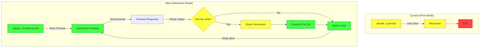
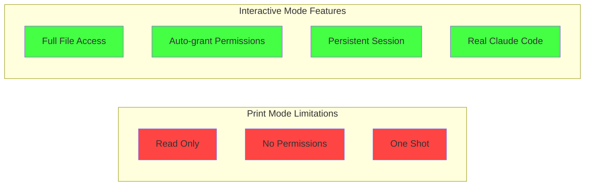
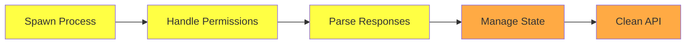

# Interactive Claude Wrapper Design

## Current vs New Architecture

```mermaid
flowchart TD
    subgraph "Current (Print Mode)"
        CP[claude -p prompt] -->|One-shot| CR[Response]
        CR --> CX[Exit]
        
        style CP fill:#ff4
        style CR fill:#ff4
        style CX fill:#f44
    end
    
    subgraph "New (Interactive Mode)"
        CI[claude --model sonnet] -->|Start Process| IP[Interactive Process]
        IP -->|Send prompt| PR[Process Response]
        PR -->|Parse output| WA{Has file write?}
        WA -->|Yes| GR[Grant Permission]
        WA -->|No| RT[Return Text]
        GR --> EF[Execute File Op]
        EF --> RT
        RT -->|Keep alive| IP
        
        style CI fill:#4f4
        style IP fill:#4f4
        style WA fill:#ff4
        style GR fill:#ff4
        style EF fill:#4f4
        style RT fill:#4f4
    end
```

## Key Differences

```mermaid
graph LR
    subgraph "Print Mode Limitations"
        L1[Read Only]
        L2[No Permissions]
        L3[One Shot]
        
        style L1 fill:#f44
        style L2 fill:#f44
        style L3 fill:#f44
    end
    
    subgraph "Interactive Mode Features"
        F1[Full File Access]
        F2[Auto-grant Permissions]
        F3[Persistent Session]
        F4[Real Claude Code]
        
        style F1 fill:#4f4
        style F2 fill:#4f4
        style F3 fill:#4f4
        style F4 fill:#4f4
    end
```

## Implementation Plan

```mermaid
flowchart LR
    S1[Spawn Process] --> S2[Handle Permissions]
    S2 --> S3[Parse Responses]
    S3 --> S4[Manage State]
    S4 --> S5[Clean API]
    
    style S1 fill:#ff4
    style S2 fill:#ff4
    style S3 fill:#ff4
    style S4 fill:#fa4
    style S5 fill:#fa4
```

Is this the right approach?