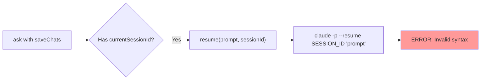
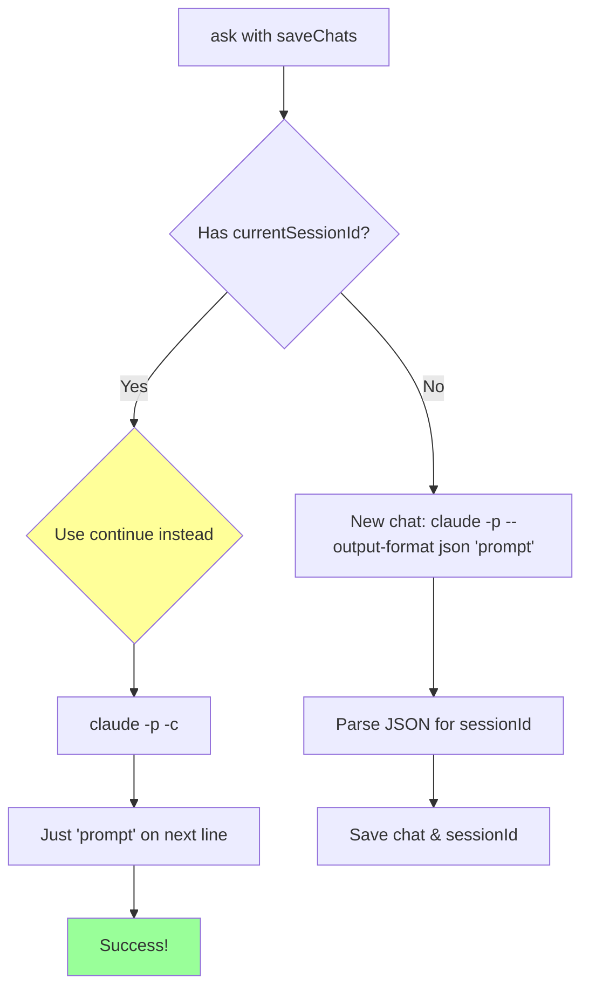

# Resume Command Fix

## Current Problem

## The Fix

## Why This Works
- `claude -p -c` continues the most recent conversation
- No need to pass session ID explicitly
- Simpler and more reliable than `--resume`