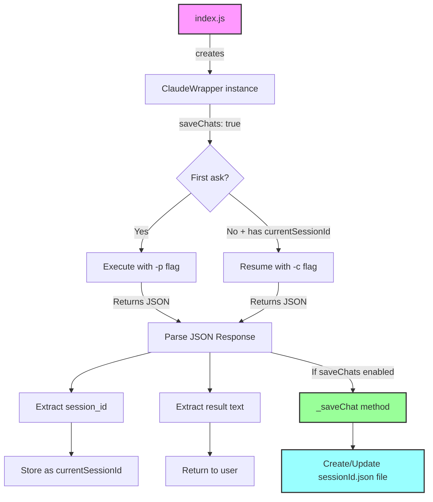
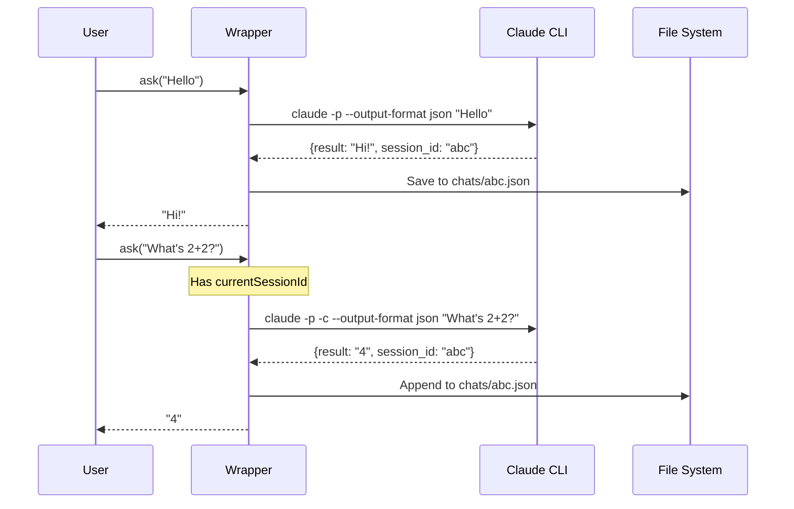
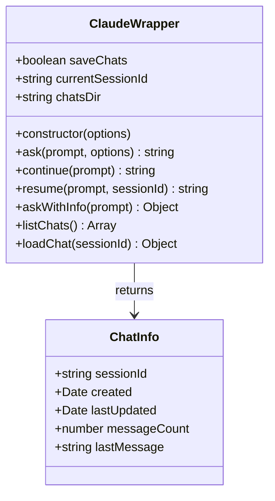

# Claude Wrapper Architecture

## Overview
This document describes the architecture and design of the Claude CLI wrapper with automatic chat management.

## Current Implementation



## How It Works

### Session Management


### API Design



## Features

### Working Features ✅
- **Auto-continue conversations** - Messages within same wrapper instance continue the conversation
- **Save chat history** - All conversations saved to JSON files
- **Session management** - Track and resume conversations by session ID
- **Cost tracking** - Get detailed usage info with `askWithInfo()`

### Architecture Decisions
- Uses Claude CLI's `-c` flag for continuing conversations (not `--resume`)
- One-shot execution model (no persistent process)
- JSON output format for reliable parsing
- File-based chat storage for simplicity

## File Structure

```
claude-wrapper/
├── claude-wrapper.js    # Main wrapper implementation
├── index.js            # Demo/test file
├── examples/           # Usage examples
│   ├── basic-usage.js
│   ├── chat-management.js
│   └── code-assistant.js
├── chats/             # Saved conversations (auto-created)
├── diagrams/          # Architecture diagrams
└── CLAUDE.md          # Co-creation rules
```

## Navigation

- [Co-Creation Rules](CLAUDE.md)
- [Source Code](claude-wrapper.js)
- [Examples](examples/)
- [README](README.md)