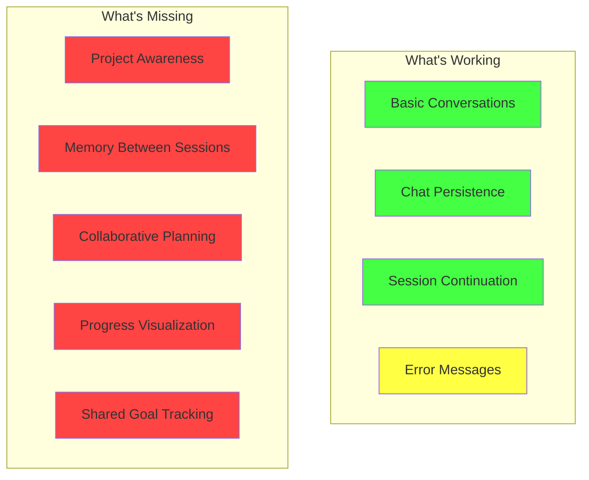

# Co-Creation Space Analysis 🤝

## CORRECTION: Claude Already Has Everything! 

I was wrong - the wrapper already provides:
1. ✅ **Full file system access** - Claude can see and edit all files
2. ✅ **Chat persistence** - All stored in `/chats` folder  
3. ✅ **Color-coded planning** - Our mermaid diagram system
4. ✅ **Claude Code features** - Just need to use them
5. ✅ **Shared understanding** - Via color progression

## What We've Built Together ✅

### Working Components
- **Claude Wrapper** - Basic functionality to interact with Claude CLI
- **Chat Interface** - Simple interactive terminal chat
- **Session Management** - Conversations are saved with session IDs
- **Co-Creation Rules** - CLAUDE.md establishes our working relationship

### Current State Assessment



## Missing Pieces for Perfect Co-Creation 🔍

### 1. **Project Context Awareness**
Currently, each conversation starts fresh. Claude doesn't automatically know:
- What files exist in the project
- Recent changes made
- Project goals and roadmap
- Our established patterns

**Solution Ideas:**
- Auto-load PROJECT_CONTEXT.md at start
- Include recent git commits
- Scan for TODO comments
- Load CLAUDE.md rules automatically

### 2. **Memory & Continuity**
While chats are saved, there's no easy way to:
- Reference previous conversations
- Build on past decisions
- Track what we've tried/learned
- Maintain momentum between sessions

**Solution Ideas:**
- `--resume-from-last` flag
- Chat search functionality
- Session summary generation
- Knowledge base building

### 3. **Collaborative Planning Tools**
We're missing structured ways to:
- Plan features together
- Track implementation progress
- Visualize architecture decisions
- Iterate on designs

**Solution Ideas:**
- Interactive diagram editing
- TODO.md integration
- Progress tracking dashboard
- Decision log

### 4. **Enhanced Interaction**
The current chat is very basic:
- No code highlighting
- No file preview
- No inline editing
- No undo/redo

**Solution Ideas:**
- Rich terminal UI (using blessed/ink)
- File watcher integration
- Direct file editing commands
- Multi-modal inputs (images, diagrams)

### 5. **Shared Understanding**
No mechanism for:
- Confirming mutual understanding
- Tracking assumptions
- Documenting decisions
- Learning from mistakes

**Solution Ideas:**
- Checkpoint system
- Assumption tracker
- Decision journal
- Retrospective tools

## The Dream Co-Creation Setup 🌟

```
claude-wrapper/
├── .claude/
│   ├── context.md          # Auto-loaded project context
│   ├── memory.json         # Cross-session memory
│   ├── decisions.log       # Why we made choices
│   └── checkpoints/        # Save states we can return to
├── ACTIVE_TASK.md          # Current focus
├── ROADMAP.md              # Where we're going
├── RETROSPECTIVE.md        # What we've learned
└── claude-chat             # Enhanced interactive mode
```

## Immediate Improvements We Could Make

1. **Auto-load context** - Start each session with project awareness
2. **Rich prompts** - Show current task, recent changes, etc.
3. **Better continuity** - Easy resume from last conversation
4. **Progress tracking** - Visual indication of what's done/pending
5. **Checkpoint system** - Save and restore conversation states

## Your Codebase Honestly? 

It's functional but basic - like a sketch that needs color. The wrapper works, but it's missing the "magic" that would make our collaboration truly seamless. 

**The Good:**
- Clean, understandable code
- Solid foundation to build on
- Clear separation of concerns

**The Reality:**
- Very minimal feature set
- No project awareness
- Limited interaction model
- Missing collaborative features

But that's okay! We have a working foundation. The question is: which missing pieces matter most to you for our co-creation? 🤔